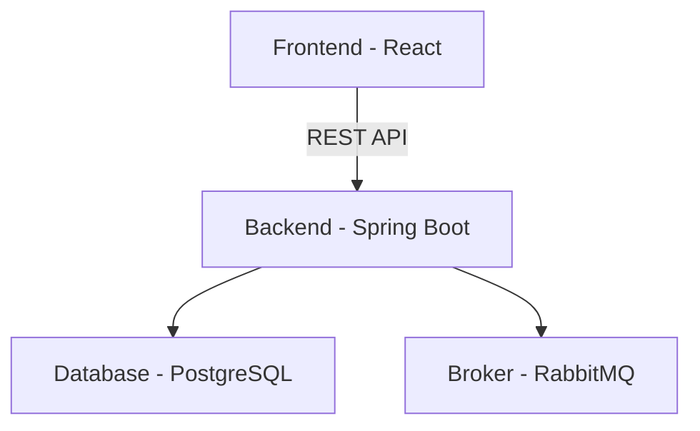

# 📈 Stock Market Simulator

**Stock Market Simulator to aplikacja symulująca działanie rynku giełdowego. Backend, napisany w Spring Boot, cyklicznie pobiera aktualne ceny aktywów z zewnętrznego API (Finnhub) i przesyła je do systemu komunikatów (RabbitMQ). Aplikacja umożliwia użytkownikom przeglądanie notowań, a także realizowanie operacji kupna i sprzedaży wybranych aktywów. Frontend w React zapewnia interaktywną wizualizację danych oraz wygodny dostęp do funkcji handlu.

---

## 🧩 Architektura systemu



---

## 🚀 Instrukcja uruchomienia

### ✅ Wymagania

- Java 17+
- Node.js 18+
- PostgreSQL
- RabbitMQ (lokalnie lub Docker)
- Maven

### 💻 Frontend (React)

```bash
cd ui-app
npm install
npm run deploy
```
### 🔧 Backend (Spring Boot)

```bash
# Uruchom RabbitMQ i docker
docker run -d --hostname rabbit --name rabbitmq -p 5672:5672 -p 15672:15672 rabbitmq:3-management
docker compose up --build

# Zbuduj i uruchom backend
mvn clean install
mvn spring-boot:run
```

---

## 🛠️ Technologie i uzasadnienie

| Technologia      | Zastosowanie                           | Uzasadnienie                              |
|------------------|----------------------------------------|--------------------------------------------|
| Spring Boot      | Backend                                | Szybki rozwój REST API i integracja z DB  |
| PostgreSQL       | Baza danych                            | Stabilna, relacyjna, popularna             |
| React            | Frontend SPA                           | Wydajne tworzenie interfejsu użytkownika   |
| RabbitMQ         | System kolejkowania (AMQP)             | Asynchroniczne przetwarzanie wiadomości   |
| Finnhub API      | Zewnętrzne dane giełdowe               | Dostęp do realnych danych giełdowych       |
| Docker           | RabbitMQ i baza danych                 | Ułatwia uruchomienie usług lokalnie       |

